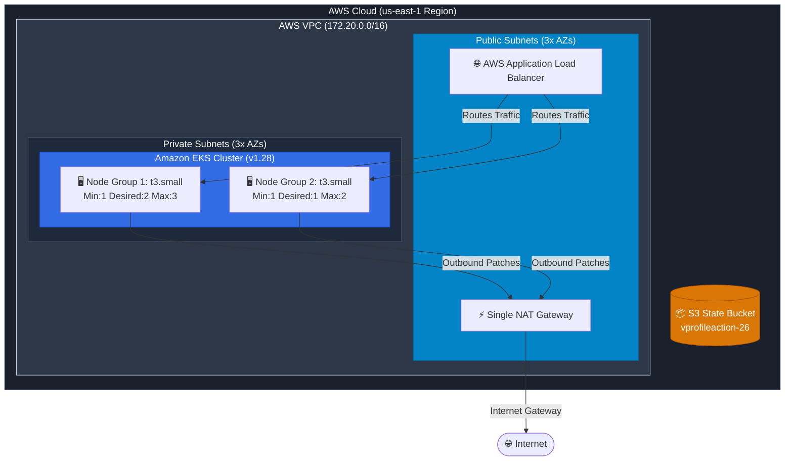
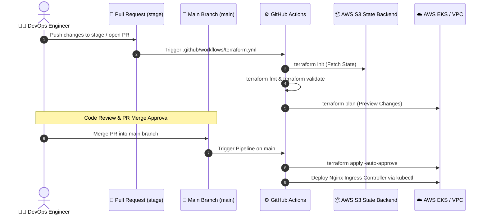

<div align="center">

# ☁️ AWS EKS & VPC Infrastructure as Code (IaC)
### *Production-Grade Automated Infrastructure Provisioning with Terraform & GitHub Actions*

[](https://www.terraform.io/)
[](https://aws.amazon.com/vpc/)
[](https://aws.amazon.com/eks/)
[](https://github.com/features/actions)

<p align="center">
  <a href="#-network--cluster-topology">Topology</a> •
  <a href="#-gitops-terraform-pipeline">GitOps Pipeline</a> •
  <a href="#-infrastructure-specifications">Specifications</a> •
  <a href="#-module-breakdown">Modules</a> •
  <a href="#-local-usage--deployment">Local Usage</a>
</p>

---

</div>

> [!IMPORTANT]
> **Enterprise IaC Standards:** This repository contains the complete Terraform code to provision a multi-AZ AWS Virtual Private Cloud (VPC) and Amazon Elastic Kubernetes Service (EKS) cluster v1.28. State management is secured remotely in an S3 backend with automated GitOps workflows enforcing `terraform plan` on staging PRs and `terraform apply` on main branch pushes.

---

## 📐 Network & Cluster Topology



---

## 🔄 GitOps Terraform Pipeline



---

## 🛠️ Infrastructure Specifications

| Category | Component | Technical Detail |
| :--- | :--- | :--- |
| **Cloud Provider** | AWS (Amazon Web Services) | Region: `us-east-1` |
| **IaC Tool** | HashiCorp Terraform | Version: `~> 1.5.1` (AWS Provider `~> 5.25.0`) |
| **State Storage** | AWS S3 Remote Backend | Bucket: `vprofileaction-26`, Key: `terraform.tfstate` |
| **Network CIDR** | Virtual Private Cloud (VPC) | `172.20.0.0/16` spanning 3 Availability Zones |
| **Public Subnets** | 3x AZ Subnets (`/24`) | `172.20.4.0/24`, `172.20.5.0/24`, `172.20.6.0/24` (`kubernetes.io/role/elb=1`) |
| **Private Subnets** | 3x AZ Subnets (`/24`) | `172.20.1.0/24`, `172.20.2.0/24`, `172.20.3.0/24` (`kubernetes.io/role/internal-elb=1`) |
| **NAT Gateway** | High-Availability Egress | 1 Single NAT Gateway for private subnets (Cost-Optimized) |
| **EKS Cluster** | Kubernetes Engine | Version `1.28` named `vprofile-EKS` |
| **Node Pools** | EKS Managed Node Groups | Dual pools using `t3.small` nodes on Amazon Linux 2 (`AL2_x86_64`) |
| **Ingress Controller** | Nginx Ingress Controller | Automated post-apply `kubectl` installation of `ingress-nginx` |

---

## 📂 Module Breakdown

<details>
<summary><b>📄 View Code Modules & Descriptions</b></summary>

| File Name | Purpose & Contents |
| :--- | :--- |
| **`terraform/vpc.tf`** | Configures `terraform-aws-modules/vpc/aws` (v5.1.2). Defines 3 public & 3 private subnets with Kubernetes ELB discovery tags and NAT Gateway rules. |
| **`terraform/eks-cluster.tf`** | Configures `terraform-aws-modules/eks/aws` (v19.19.1). Provisions `vprofile-EKS` cluster and Managed Node Groups `one` and `two`. |
| **`terraform/terraform.tf`** | Locks provider versions (`hashicorp/aws`, `hashicorp/kubernetes`) and configures the S3 remote backend. |
| **`terraform/main.tf`** | Configures Kubernetes and AWS provider blocks, availability zone data sources, and local variable definitions. |
| **`terraform/variables.tf`** | Defines input variables (`region` default: `us-east-1`, `clusterName` default: `vprofile-EKS`). |
| **`terraform/outputs.tf`** | Exports output attributes (`cluster_name`, `cluster_endpoint`, `region`, `cluster_security_group_id`). |
</details>

---

## 🚀 Local Usage & Deployment

> [!NOTE]
> Ensure you have the [AWS CLI](https://aws.amazon.com/cli/), [Terraform CLI (v1.5+)](https://www.terraform.io/), and [kubectl](https://kubernetes.io/docs/tasks/tools/) installed locally.

```bash
# 1. Clone the repository and navigate to the terraform directory
cd terraform

# 2. Initialize working directory & download S3 backend state
terraform init

# 3. Validate syntax and format code
terraform fmt -check
terraform validate

# 4. Generate and review execution plan
terraform plan

# 5. Apply infrastructure changes
terraform apply -auto-approve

# 6. Configure local kubeconfig to interact with the new cluster
aws eks update-kubeconfig --region us-east-1 --name vprofile-EKS
```

---

<div align="center">
  <b>Built with ❤️ by Naveen • Powered by Terraform & AWS EKS</b>
</div>
